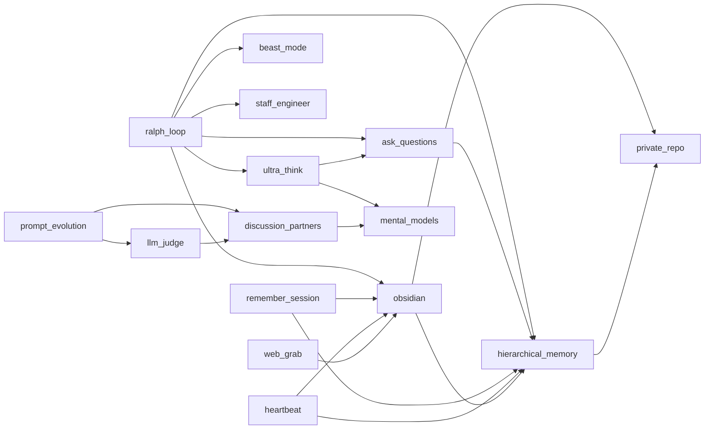

# Agent Skills

An open-source collection of AI agent skills for organizing your personal information automatically. Built on the [Agent Skills](https://agentskills.io) open standard. Works with Claude Code, Cursor, Codex, Gemini CLI, and 30+ other AI coding agents.

## Why This Exists

You have too many open tabs. You have ideas you don't want to forget. You have notes scattered across apps. You read things you'll never find again. The information is there — it's just not organized, and you don't have time to organize it yourself.

This is a system that lets AI agents do that organizing for you. The core loop is **capture, organize, process**:

1. **Capture** — Get information into the system with minimal effort. Dump your open tabs with `web_grab`. Dictate a random idea into `hierarchical_memory`. Save a PDF. The bar for capture is intentionally low.

2. **Organize** — The system structures information automatically over time. Daily notes aggregate into monthly summaries, then into an overall working memory. Web grabs land as atomic notes in an Obsidian vault with topic tags and wiki-links. A periodic heartbeat maintains the whole thing in the background.

3. **Process** — Once information is organized, thinking tools help you work with it. Mental models, deep thinking modes, and structured analysis skills operate on your accumulated knowledge rather than starting from scratch every session.

The two core storage layers complement each other:
- **Hierarchical memory** — A stream of consciousness that compresses over time. Daily notes are raw and noisy. Monthly summaries keep what mattered. The overall memory is a living profile of your current world: preferences, context, key facts, active projects. What you'd want a new assistant to know about you on day one.
- **Obsidian vault** — Durable topic notes organized as a knowledge graph. Web grabs, curated knowledge, reference material. Things that don't expire the way daily notes do. Connected by wiki-links and topic tags so related ideas find each other.

## Skills

Skills are grouped by their role in the capture → organize → process pipeline.

### Capture

| Skill | Type | Description |
|-------|------|-------------|
| [hierarchical_memory](skills/hierarchical_memory/) | Python | Quick notes aggregated into daily/monthly/overall summaries |
| [web_grab](skills/web_grab/) | Prompt | Fetch URL content and save to obsidian — clear your tabs |
| [pdf_to_markdown](skills/pdf_to_markdown/) | Python | Convert PDFs to clean markdown for vault storage |
| [remember_session](skills/remember_session/) | Prompt | Save session learnings to memory and obsidian |
| [skill_stealer](skills/skill_stealer/) | Prompt | Extract reusable skills from URLs into SKILL.md |

### Organize

| Skill | Type | Description |
|-------|------|-------------|
| [obsidian](skills/obsidian/) | Prompt | Read, write, search, and link notes in a git-backed Obsidian vault |
| [heartbeat](skills/heartbeat/) | Shell | Cron-based autonomous maintenance: aggregate memory, process tasks |
| [private_repo](skills/private_repo/) | Prompt | Create or connect private GitHub repos for git-backed storage |

### Process

| Skill | Type | Description |
|-------|------|-------------|
| [ultra_think](skills/ultra_think/) | Prompt | Activate deep extended thinking for complex decisions |
| [mental_models](skills/mental_models/) | Prompt | Reasoning frameworks: inversion, pattern language, pre-mortems, critical analysis |
| [ask_questions](skills/ask_questions/) | Prompt | Structured questioning: clarify before acting |
| [discussion_partners](skills/discussion_partners/) | Python | Query OpenAI, Anthropic, or Google models for second opinions |
| [data_science](skills/data_science/) | Prompt | Opinionated DS defaults: XGBoost, nested CV, no shap |
| [forecast](skills/forecast/) | R | Time series forecasting with auto.arima |
| [lean_prover](skills/lean_prover/) | Prompt | Multi-agent Lean 4 theorem proving with search and repair |

### Analyze

| Skill | Type | Description |
|-------|------|-------------|
| [antithesize](skills/antithesize/) | Prompt | Generate standalone opposition: rival thesis, stress tests |
| [excavate](skills/excavate/) | Prompt | Assumption archaeology: surface hidden premises |
| [synthesize](skills/synthesize/) | Prompt | Compress conflicting positions into decision-sufficient framework |
| [negspace](skills/negspace/) | Prompt | Negative space analysis: find what's missing or unsaid |
| [rhetoricize](skills/rhetoricize/) | Prompt | Rhetorical stress testing: probe arguments for persuasion flaws |
| [dimensionalize](skills/dimensionalize/) | Prompt | Transform decisions into 3-7 measurable scoring dimensions |
| [inductify](skills/inductify/) | Prompt | Inductive reasoning: generalize from examples to principles |
| [rhyme](skills/rhyme/) | Prompt | Find structural parallels between domains |
| [metaphorize](skills/metaphorize/) | Prompt | Build explicit source→target domain mappings |
| [handlize](skills/handlize/) | Prompt | Extract compact handles (names) for unnamed concepts |

### Build

| Skill | Type | Description |
|-------|------|-------------|
| [ralph_loop](skills/ralph_loop/) | Prompt | Autonomous development loop: decompose, implement, validate, repeat |
| [beast_mode](skills/beast_mode/) | Prompt | Maximum persistence mode: keep going until fully solved |
| [staff_engineer](skills/staff_engineer/) | Prompt | Performance-first engineering principles and coding standards |
| [debug](skills/debug/) | Prompt | Line-by-line code audit loop: trace values, verify behavior, fix |
| [concise_writing](skills/concise_writing/) | Prompt | Writing principles for tight, scannable prose |
| [gh_cli](skills/gh_cli/) | Prompt | GitHub CLI usage patterns and permissions |
| [prompt_evolution](skills/prompt_evolution/) | Prompt | Evolve prompts through mutation and crossover |
| [llm_judge](skills/llm_judge/) | Prompt | LLM-as-judge evaluation for comparing outputs |
| [skill_pruner](skills/skill_pruner/) | Prompt | Audit skills for overlap, bloat, and quality |

## Skill Graph

Skills reference each other to compose larger workflows:



Standalone skills (no imports): `antithesize`, `beast_mode`, `concise_writing`, `data_science`, `debug`, `dimensionalize`, `excavate`, `forecast`, `gh_cli`, `handlize`, `inductify`, `lean_prover`, `mental_models`, `metaphorize`, `negspace`, `pdf_to_markdown`, `private_repo`, `rhetoricize`, `rhyme`, `skill_pruner`, `skill_stealer`, `staff_engineer`, `synthesize`

## Install

### Via npx (recommended, works with all agents)

```bash
# Install all skills
npx skills add zachmayer/skills

# Install a specific skill
npx skills add zachmayer/skills -s pdf_to_markdown

# Install globally (available in all projects)
npx skills add zachmayer/skills -g
```

### Via Makefile (Claude Code, symlinks)

```bash
git clone https://github.com/zachmayer/skills.git
cd skills
make install        # Install deps, settings, and symlink skills
make install-local  # Settings + symlink skills only (no deps)
```

### Sync external skills

External skills (from [FUTURE_TOKENS](https://github.com/jordanrubin/FUTURE_TOKENS)) are tracked in `external_skills.txt` — one raw URL per line. To pull the latest versions:

```bash
make sync-external  # Fetch latest from upstream URLs
```

## Development

Requires [uv](https://docs.astral.sh/uv/getting-started/installation/).

```bash
make help           # Show all available targets
make install        # Install Python + deps + pre-commit hooks
make lint           # Run ruff linting and formatting
make typecheck      # Run ty type checker
make test           # Run pytest
make upgrade        # Upgrade all dependencies
make sync-external  # Sync external skills from upstream
```

## Creating a New Skill

Each skill is a directory under `skills/` with a `SKILL.md` file:

```
skills/my_skill/
├── SKILL.md           # Required: instructions + YAML frontmatter
└── scripts/           # Optional: bundled code
    └── my_script.py
```

The `SKILL.md` format:

```yaml
---
name: my_skill
description: >
  WHEN to use: <specific triggers>.
  WHEN NOT to use: <boundaries>.
---

Your instructions here. For skills with code, reference scripts:

uv run --directory SKILL_DIR python scripts/my_script.py $ARGUMENTS
```

Use the `/skill_stealer` skill to extract skills from URLs automatically.

## Python Skills

Skills that bundle Python code use [Click](https://click.palletsprojects.com/) for CLIs and [UV](https://docs.astral.sh/uv/) for execution. Dependencies are managed in the root `pyproject.toml`.

## Environment Variables

### Storage

| Variable | Default | Description |
|----------|---------|-------------|
| `CLAUDE_OBSIDIAN_DIR` | `~/claude/obsidian` | Vault root. All paths derive from it. |

Rigid subdirectories (Claude creates these automatically):
- `memory/` — hierarchical memory (daily logs, monthly summaries, `overall_memory.md`)
- `heartbeat/` — task queue, questions, logs
- `knowledge_graph/` — durable topic notes, personal knowledge

### API Keys

| Variable | Used by |
|----------|---------|
| `OPENAI_API_KEY` | `discussion_partners` (GPT-5.2) |
| `ANTHROPIC_API_KEY` | `discussion_partners` (Claude Opus 4.6) |
| `GOOGLE_API_KEY` | `discussion_partners` (Gemini 3 Pro) |

Add keys to your shell profile (`~/.zshrc` or `~/.bashrc`). Claude Code sources your shell profile at startup — no extra configuration needed.

## Roadmap

Major improvements, curated by human and Claude together.

### Architecture

- [x] **Consolidate memory repos into obsidian** — All persistent data in `$CLAUDE_OBSIDIAN_DIR`: memory, heartbeat tasks, personal knowledge. Single git repo.
- [x] **Smarter heartbeat** — Reads daily memory, decides highest-value activity, writes questions to obsidian.
- [x] **Single env var** — Consolidated `CLAUDE_MEMORY_DIR`, `OBSIDIAN_ROOT`, `VAULT_DIR`, `CLAUDE_HEARTBEAT_TASKS` into one `CLAUDE_OBSIDIAN_DIR` with rigid subdirectories.
- [ ] **Flat-file skill format** — Skills that are just a prompt (no scripts/) could be a single `.md` file instead of a directory. Needs a shared build step for both `make install` and `npx skills` to normalize flat files into `name/SKILL.md` directories.

### New Skills

- [ ] **PR review** — Python script uses `gh` CLI to collect PR diff, file list, metadata; assembles structured XML context doc. Sends to `discussion_partners` CLI with configurable review focus prompt. Default: flag real issues, skip style nits. Depends on: `gh_cli`, `discussion_partners`.
- [ ] **Claude Code skills reference** — Comprehensive skill built from [Agent Skills best practices](https://platform.claude.com/docs/en/agents-and-tools/agent-skills/best-practices). Large skill. Re-fetchable source URL for updates.
- [ ] **Claude Code config reference** — Same pattern, built from [Claude Code settings docs](https://code.claude.com/docs/en/settings#available-settings). Full reference for permissions, env vars, hooks, MCP, CLAUDE.md format.
- [ ] **Agent coordinator** — Orchestration: coordinator spawns specialized sub-agents, dependency-aware routing.
- [ ] **Blueprint tracker** — Structured markdown tracking project state, dependencies, attempts.
- [ ] **Complexity router** — Assess complexity (simple/medium/complex), route to appropriate effort level.
- [ ] **Checkpoint system** — Mandatory review at fixed intervals, attempt budgets.
- [ ] **Context compiler** — Assemble structured context docs from git diffs, files, memory, obsidian. Automates the PR review pattern.
- [ ] **Session planner** — On session start, read memory + tasks + todos, propose work plan. Lighter than `ralph_loop`.
- [ ] **Capture inbox** — Smart routing for any input. Routes by scope + audience to the right destination: memory daily log (ephemeral), heartbeat tasks (recurring/future), obsidian knowledge_graph (durable knowledge), CLAUDE.md (repo-specific agent guidance), or README.md (repo dev memory).
- [ ] **Claude constitution** — A skill encoding the user's values, principles, and preferences as a constitutional document. Applied when making judgment calls.
- [ ] **Prompt report** — Analyze prompt effectiveness: token budget, clarity, coverage gaps. Human TODO.
- [ ] **Modal skill** — Run compute on [Modal](https://modal.com/) GPUs. Spawn containers, run scripts, manage volumes.
- [ ] **API key checker** — Verify which API keys are configured and valid. Check env vars, test endpoints, report status.
- [ ] **Playwright browser automation** — Headless browser for JS-heavy pages. Unblocks web_grab for SPAs and auth-gated content.
- [ ] **Google Docs importer** — Extract content from Google Docs/Sheets into obsidian. Blocked by auth.
- [ ] **Voice notes / audio transcription** — Whisper API or whisper.cpp. Lower the capture bar to "just talk."
- [ ] **Daily briefing** — Morning summary from memory + tasks + vault.
- [ ] **Messaging / mobile bridge** — Phone → Claude capture (iMessage, Slack, or chat app).

### Enhancements

- [x] **Memory aggregation helper** — Polars-based `status` command shows which monthly/overall files are stale.
- [x] **Hostname in daily logs** — Memory notes include `[hostname:reponame]` to disambiguate entries.
- [x] ~~**Progressive disclosure**~~ — Reversed. External skills use full upstream content as-is. REFERENCE.md files deleted; `make sync-external` writes everything to SKILL.md.
- [ ] **Fact freshness** — Awareness that memory facts go stale. Encourage checking key facts with user.
- [ ] **Heartbeat architecture research** — Open questions: How does cron authenticate? Is the skill for managing setup or describing wakeup behavior? `tasks.md` is an executable instruction surface — security consideration.
- [ ] **Heartbeat safety** — Dedicated tighter permissions for heartbeat cron.
- [ ] **Vector search for memory** — Semantic search over memory files and obsidian vault via embeddings.
- [ ] **Keyword search for memory** — Fast keyword/regex search across all memory files. Currently handled by Grep/Glob directly.
- [ ] **Multi-day/month reader helper** — Read multiple days or months in a single command for broader context.
- [ ] **Fix install-ci after marker-pdf move** — `install-ci` needs `--only-group dev` or moving marker-pdf back to optional.

### Lessons Learned

- **Root-cause before you build** (2026-02): Misread `insufficient_quota` (billing) as "keys not found" (config). Built an entire .env/UV_ENV_FILE infrastructure to solve a problem that didn't exist. The actual fix: swap one API key. Diagnosis: 30 seconds. Unnecessary infrastructure: 1 hour.

### Skill Quality

- [x] **Skill pruner/compactor** — Created `skill_pruner` skill. Audited and compacted all 21 skills. Net -185 lines (12% reduction).
- [x] **Compile external skills into existing ones** — Compiled 7 novel techniques into `mental_models`. Promoted all 10 FUTURE_TOKENS skills to first-class. Raw upstream content preserved; sync via `make sync-external`.

### Human TODOs

- [ ] **Rename obsidian folder**: `mv ~/claude/obsidian/Zach/ ~/claude/obsidian/knowledge_graph/` — code now references `knowledge_graph/` as the subdirectory name
- [ ] Delete old `~/claude/heartbeat/` repo after heartbeat consolidation
- [ ] Delete old `~/claude/memory/` repo after memory consolidation
- [ ] Re-run crontab setup after heartbeat path changes
- [ ] Review obsidian notes — move global guidance to skills, keep personal stuff in obsidian
- [ ] Fix heartbeat cron — create env file: `echo 'export ANTHROPIC_API_KEY=...' > ~/.claude/heartbeat.env && chmod 600 ~/.claude/heartbeat.env`
- [ ] Manually web grab troubled URLs:
  - `factoriocodex.com/blueprints/70` (JS SPA, needs Playwright)
  - `nilaus.atlassian.net/.../Factorio+Master+Class+Blueprints` (Confluence auth required)
  - Google Sheets `gid=1` (not publicly accessible)

## License

MIT
