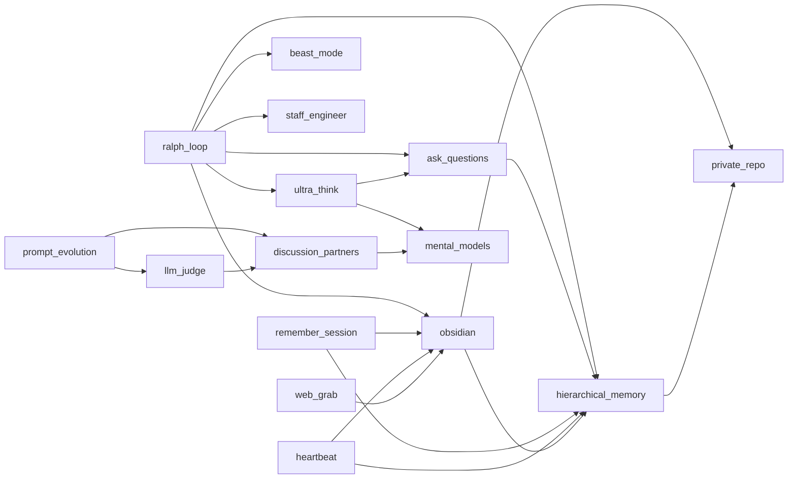

# Agent Skills

A shared, open-source collection of agent skills following the [Agent Skills](https://agentskills.io) open standard. Works with Claude Code, Cursor, Codex, Gemini CLI, and 30+ other AI coding agents.

## Skills

| Skill | Type | Description |
|-------|------|-------------|
| [antithesize](skills/antithesize/) | Prompt | Generate standalone opposition: rival thesis, refutation, stress tests |
| [ask_questions](skills/ask_questions/) | Prompt | Structured questioning framework: clarify before acting |
| [beast_mode](skills/beast_mode/) | Prompt | Maximum persistence mode: keep going until fully solved |
| [concise_writing](skills/concise_writing/) | Prompt | Writing principles for tight, scannable prose |
| [data_science](skills/data_science/) | Prompt | Opinionated DS defaults: XGBoost, nested CV, no shap |
| [debug](skills/debug/) | Prompt | Line-by-line code audit loop: trace values, verify behavior, fix |
| [dimensionalize](skills/dimensionalize/) | Prompt | Transform decisions into 3-7 measurable scoring dimensions |
| [discussion_partners](skills/discussion_partners/) | Python | Query OpenAI, Anthropic, or Google models via pydantic-ai |
| [excavate](skills/excavate/) | Prompt | Assumption archaeology: surface hidden premises in arguments |
| [forecast](skills/forecast/) | R | Time series forecasting with auto.arima |
| [gh_cli](skills/gh_cli/) | Prompt | GitHub CLI usage patterns and permissions |
| [handlize](skills/handlize/) | Prompt | Extract compact handles (names) for unnamed concepts |
| [heartbeat](skills/heartbeat/) | Shell | Cron-based autonomous task processing for Claude Code |
| [hierarchical_memory](skills/hierarchical_memory/) | Python | Notes aggregated into daily/weekly/monthly/overall summaries |
| [inductify](skills/inductify/) | Prompt | Inductive reasoning: generalize from examples to principles |
| [lean_prover](skills/lean_prover/) | Prompt | Multi-agent Lean 4 theorem proving with search and repair |
| [llm_judge](skills/llm_judge/) | Prompt | LLM-as-judge evaluation for comparing outputs with rubrics |
| [mental_models](skills/mental_models/) | Prompt | Reasoning frameworks: inversion, pattern language, pre-mortems, critical analysis |
| [metaphorize](skills/metaphorize/) | Prompt | Build explicit source→target domain mappings with formulas and metrics |
| [negspace](skills/negspace/) | Prompt | Negative space analysis: find what's missing or unsaid |
| [obsidian](skills/obsidian/) | Prompt | Read, write, search, and link notes in a git-backed Obsidian vault |
| [pdf_to_markdown](skills/pdf_to_markdown/) | Python | Convert PDFs to clean markdown using marker |
| [private_repo](skills/private_repo/) | Prompt | Create or connect private GitHub repos for sensitive data |
| [prompt_evolution](skills/prompt_evolution/) | Prompt | Evolve prompts through mutation and crossover over generations |
| [ralph_loop](skills/ralph_loop/) | Prompt | Autonomous development loop: decompose, implement, validate, repeat |
| [remember_session](skills/remember_session/) | Prompt | Save session learnings to hierarchical memory and obsidian |
| [rhetoricize](skills/rhetoricize/) | Prompt | Rhetorical stress testing: probe arguments for persuasion flaws |
| [rhyme](skills/rhyme/) | Prompt | Find structural parallels between domains (conceptual rhyming) |
| [skill_pruner](skills/skill_pruner/) | Prompt | Audit skills for overlap, bloat, and quality; propose compactions |
| [skill_stealer](skills/skill_stealer/) | Prompt | Extract skills from URLs into SKILL.md with degrees-of-freedom analysis |
| [staff_engineer](skills/staff_engineer/) | Prompt | Performance-first engineering principles and coding standards |
| [synthesize](skills/synthesize/) | Prompt | Compress conflicting positions into decision-sufficient framework |
| [ultra_think](skills/ultra_think/) | Prompt | Activate deep extended thinking for complex decisions |
| [web_grab](skills/web_grab/) | Prompt | Fetch URL content and save to obsidian; auto or manual fallback |

## Skill Graph

Skills reference each other to compose larger workflows:



Standalone skills (no imports): `antithesize`, `beast_mode`, `concise_writing`, `data_science`, `debug`, `dimensionalize`, `excavate`, `forecast`, `gh_cli`, `handlize`, `inductify`, `lean_prover`, `mental_models`, `metaphorize`, `negspace`, `pdf_to_markdown`, `private_repo`, `rhetoricize`, `rhyme`, `skill_pruner`, `skill_stealer`, `staff_engineer`, `synthesize`

## Install

### Via npx (recommended, works with all agents)

```bash
# Install all skills
npx skills add zachmayer/skills

# Install a specific skill
npx skills add zachmayer/skills -s pdf_to_markdown

# Install globally (available in all projects)
npx skills add zachmayer/skills -g
```

### Via Makefile (Claude Code, symlinks)

```bash
git clone https://github.com/zachmayer/skills.git
cd skills
make install        # Install deps, settings, and symlink skills
make install-local  # Settings + symlink skills only (no deps)
```

### Sync external skills

External skills (from [FUTURE_TOKENS](https://github.com/jordanrubin/FUTURE_TOKENS)) are tracked in `external_skills.txt` — one raw URL per line. To pull the latest versions:

```bash
make sync-external  # Fetch latest from upstream URLs
```

## Development

Requires [uv](https://docs.astral.sh/uv/getting-started/installation/).

```bash
make help           # Show all available targets
make install        # Install Python + deps + pre-commit hooks
make lint           # Run ruff linting and formatting
make typecheck      # Run ty type checker
make test           # Run pytest
make upgrade        # Upgrade all dependencies
make sync-external  # Sync external skills from upstream
```

## Creating a New Skill

Each skill is a directory under `skills/` with a `SKILL.md` file:

```
skills/my_skill/
├── SKILL.md           # Required: instructions + YAML frontmatter
└── scripts/           # Optional: bundled code
    └── my_script.py
```

The `SKILL.md` format:

```yaml
---
name: my_skill
description: >
  WHEN to use: <specific triggers>.
  WHEN NOT to use: <boundaries>.
---

Your instructions here. For skills with code, reference scripts:

uv run --directory SKILL_DIR python scripts/my_script.py $ARGUMENTS
```

Use the `/skill_stealer` skill to extract skills from URLs automatically.

## Python Skills

Skills that bundle Python code use [Click](https://click.palletsprojects.com/) for CLIs and [UV](https://docs.astral.sh/uv/) for execution. Dependencies are managed in the root `pyproject.toml`.

Required environment variables for specific skills:
- `discussion_partners`: `OPENAI_API_KEY`, `ANTHROPIC_API_KEY`, or `GOOGLE_API_KEY`

## Roadmap

Major improvements, curated by human and Claude together.

### Architecture

- [x] **Consolidate memory repos into obsidian** — All persistent data in `~/claude/obsidian/`: memory, heartbeat tasks, TODOs, personal knowledge. Single git repo.
- [x] **Smarter heartbeat** — Reads daily memory, decides highest-value activity, writes questions to obsidian.

### Skill Quality

- [x] **Skill pruner/compactor** — Created `skill_pruner` skill. Audited and compacted all 21 skills: ultra_think 169→50 lines, staff_engineer 140→124, lean_prover 168→136, ask_questions 83→57, discussion_partners 80→71. Net -185 lines (12% reduction).
- [x] **Compile external skills into existing ones** — Compiled 7 novel techniques into `mental_models`. Promoted all 10 FUTURE_TOKENS skills to first-class (flat hierarchy, SKILL.md, tested). Raw upstream content preserved; sync via `make sync-external`.

### Human TODOs

- [ ] Delete old `~/claude/heartbeat/` repo after heartbeat consolidation
- [ ] Delete old `~/claude/memory/` repo after memory consolidation
- [ ] Re-run crontab setup after heartbeat path changes
- [ ] Review and merge PR on `agent-skills` branch
- [ ] Review obsidian notes — move global guidance to skills, keep personal stuff in obsidian

## License

MIT
