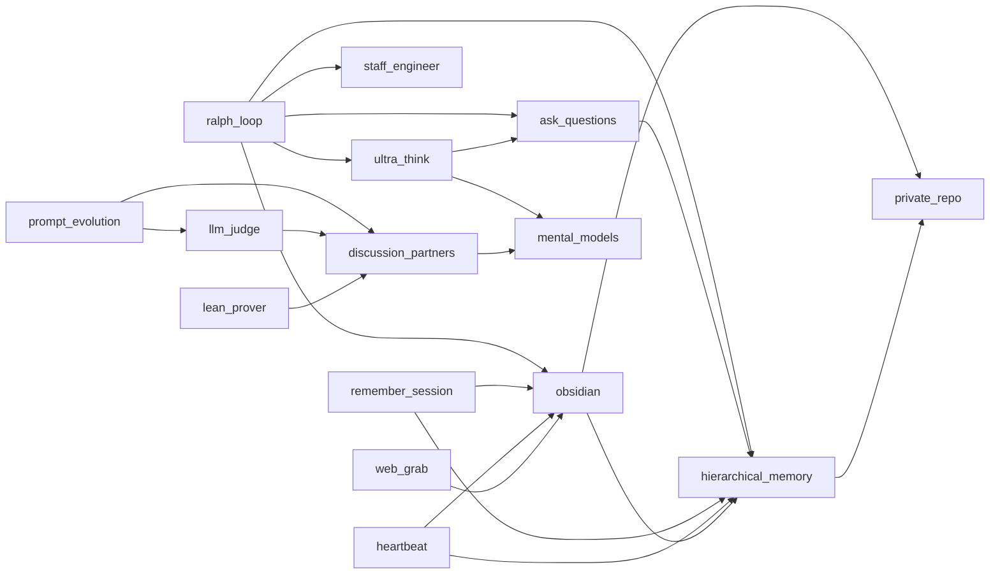

# Agent Skills

An open-source collection of AI agent skills for organizing your personal information automatically. Built on the [Agent Skills](https://agentskills.io) open standard. Works with Claude Code, Cursor, Codex, Gemini CLI, and 30+ other AI coding agents.

## Why This Exists

You have too many open tabs. You have ideas you don't want to forget. You have notes scattered across apps. You read things you'll never find again. The information is there — it's just not organized, and you don't have time to organize it yourself.

This is a system that lets AI agents do that organizing for you. The core loop is **capture, organize, process**:

1. **Capture** — Get information into the system with minimal effort. Dump your open tabs with `web_grab`. Dictate a random idea into `hierarchical_memory`. Save a PDF. The bar for capture is intentionally low.

2. **Organize** — The system structures information automatically over time. Daily notes aggregate into monthly summaries, then into an overall working memory. Web grabs land as atomic notes in an Obsidian vault with topic tags and wiki-links. A periodic heartbeat maintains the whole thing in the background.

3. **Process** — Once information is organized, thinking tools help you work with it. Mental models, deep thinking modes, and structured analysis skills operate on your accumulated knowledge rather than starting from scratch every session.

The two core storage layers complement each other:
- **Hierarchical memory** — A stream of consciousness that compresses over time. Daily notes are raw and noisy. Monthly summaries keep what mattered. The overall memory is a living profile of your current world: preferences, context, key facts, active projects. What you'd want a new assistant to know about you on day one.
- **Obsidian vault** — Durable topic notes organized as a knowledge graph. Web grabs, curated knowledge, reference material. Things that don't expire the way daily notes do. Connected by wiki-links and topic tags so related ideas find each other.

## Information Hierarchy

Four tiers of persistent information, each with a different purpose and lifetime:

| Tier | Location | Purpose | Lifetime |
|------|----------|---------|----------|
| **CLAUDE.md** | Per-repo | Agent config — how Claude behaves here | Permanent per repo |
| **README.md** | Per-repo | Dev memory — roadmap, decisions, lessons | Permanent per repo |
| **Hierarchical memory** | `memory/` | Personal working memory — daily notes, monthly summaries, overall | Compresses over time |
| **Knowledge graph** | `knowledge_graph/` | Durable topic notes, reference, web grabs | Permanent |

**CLAUDE.md** is read by every agent session. It defines conventions, anti-patterns, and build commands for a specific repo. Think of it as the repo's operating manual for AI agents.

**README.md** (this file, in the skills repo) serves as dev memory — the roadmap, architectural decisions, and lessons learned that persist across sessions. Updated as the project evolves.

**Hierarchical memory** is a stream of consciousness that compresses over time. Daily notes are raw and noisy. Monthly summaries keep what mattered. The overall memory is a living profile: preferences, context, key facts, active projects. The `note` command reports aggregation staleness automatically — finish your notes, then aggregate stale months.

**Knowledge graph** holds durable topic notes in an Obsidian vault. Web grabs, curated knowledge, reference material — things that don't expire the way daily notes do. Connected by wiki-links and topic tags.

## Skills

Skills are grouped by their role in the capture → organize → process pipeline.

### Capture

| Skill | Type | Description |
|-------|------|-------------|
| [hierarchical_memory](skills/hierarchical_memory/) | Python | Quick notes aggregated into daily/monthly/overall summaries |
| [web_grab](skills/web_grab/) | Python | Fetch URL content and save to obsidian — Playwright for JS SPAs |
| [pdf_to_markdown](skills/pdf_to_markdown/) | Python | Convert PDFs to clean markdown for vault storage |
| [remember_session](skills/remember_session/) | Prompt | Save session learnings to memory and obsidian |
| [skill_stealer](skills/skill_stealer/) | Prompt | Extract reusable skills from URLs into SKILL.md |

### Organize

| Skill | Type | Description |
|-------|------|-------------|
| [obsidian](skills/obsidian/) | Prompt | Read, write, search, and link notes in a git-backed Obsidian vault |
| [heartbeat](skills/heartbeat/) | Shell | launchd-based autonomous agent: picks up GitHub Issues, creates PRs |
| [private_repo](skills/private_repo/) | Prompt | Create or connect private GitHub repos for git-backed storage |

### Process

| Skill | Type | Description |
|-------|------|-------------|
| [ultra_think](skills/ultra_think/) | Prompt | Activate deep extended thinking for complex decisions |
| [mental_models](skills/mental_models/) | Prompt | 33 reasoning frameworks incl. critical analysis protocols (antithesize, excavate, negspace, rhetoricize, etc.) |
| [ask_questions](skills/ask_questions/) | Prompt | Structured questioning: clarify before acting |
| [discussion_partners](skills/discussion_partners/) | Python | Query OpenAI, Anthropic, or Google models for second opinions |
| [data_science](skills/data_science/) | Prompt | Opinionated DS defaults: XGBoost, nested CV, no shap |
| [forecast](skills/forecast/) | R | Time series forecasting with auto.arima |
| [lean_prover](skills/lean_prover/) | Prompt | Multi-agent Lean 4 theorem proving with search and repair |

### Build

| Skill | Type | Description |
|-------|------|-------------|
| [ralph_loop](skills/ralph_loop/) | Prompt | Autonomous development loop: decompose, implement, validate, repeat |
| [staff_engineer](skills/staff_engineer/) | Prompt | Performance-first engineering principles, coding standards, and debugging |
| [concise_writing](skills/concise_writing/) | Prompt | Writing principles for tight, scannable prose |
| [gh_cli](skills/gh_cli/) | Prompt | GitHub CLI usage patterns and permissions |
| [prompt_evolution](skills/prompt_evolution/) | Prompt | Evolve prompts through mutation and crossover |
| [llm_judge](skills/llm_judge/) | Prompt | LLM-as-judge evaluation for comparing outputs |
| [pr_review](skills/pr_review/) | Python | External AI code review: fetch PR context via gh, send to GPT-5.2 |
| [api_key_checker](skills/api_key_checker/) | Python | Verify AI provider API keys are configured and valid |
| [skill_pruner](skills/skill_pruner/) | Prompt | Audit skills for overlap, bloat, and quality |

## Skill Graph

Skills reference each other to compose larger workflows:



Standalone skills (no imports): `api_key_checker`, `concise_writing`, `data_science`, `forecast`, `gh_cli`, `pdf_to_markdown`, `pr_review`, `skill_pruner`, `skill_stealer`

## Install

### Via npx (recommended, works with all agents)

```bash
# Install all skills
npx skills add zachmayer/skills

# Install a specific skill
npx skills add zachmayer/skills -s pdf_to_markdown

# Install globally (available in all projects)
npx skills add zachmayer/skills -g
```

### Via Makefile (Claude Code, symlinks)

```bash
git clone https://github.com/zachmayer/skills.git
cd skills
make install        # Install deps, settings, and symlink skills
make install-local  # Settings + symlink skills only (no deps)
```

## Development

Requires [uv](https://docs.astral.sh/uv/getting-started/installation/).

```bash
make help           # Show all available targets
make install        # Install Python + deps + pre-commit hooks
make lint           # Run ruff linting and formatting
make typecheck      # Run ty type checker
make test           # Run pytest
make upgrade        # Upgrade all dependencies

```

## Creating a New Skill

Each skill is a directory under `skills/` with a `SKILL.md` file:

```
skills/my_skill/
├── SKILL.md           # Required: instructions + YAML frontmatter
└── scripts/           # Optional: bundled code
    └── my_script.py
```

The `SKILL.md` format:

```yaml
---
name: my_skill
description: >
  WHEN to use: <specific triggers>.
  WHEN NOT to use: <boundaries>.
---

Your instructions here. For skills with code, reference scripts:

uv run --directory SKILL_DIR python scripts/my_script.py $ARGUMENTS
```

Use the `/skill_stealer` skill to extract skills from URLs automatically.

## Python Skills

Skills that bundle Python code use [Click](https://click.palletsprojects.com/) for CLIs and [UV](https://docs.astral.sh/uv/) for execution. Dependencies are managed in the root `pyproject.toml`.

## Environment Variables

### Storage

| Variable | Default | Description |
|----------|---------|-------------|
| `CLAUDE_OBSIDIAN_DIR` | `~/claude/obsidian` | Vault root. All paths derive from it. |

Rigid subdirectories (Claude creates these automatically):
- `memory/` — hierarchical memory (daily logs, monthly summaries, `overall_memory.md`)
- `heartbeat/` — legacy (task queue replaced by GitHub Issues in v2)
- `knowledge_graph/` — durable topic notes, personal knowledge

### API Keys

| Variable | Used by |
|----------|---------|
| `OPENAI_API_KEY` | `discussion_partners` (`openai:` and `openai-responses:` models) |
| `ANTHROPIC_API_KEY` | `discussion_partners` (`anthropic:` models) |
| `GOOGLE_API_KEY` | `discussion_partners` (`google-gla:` models) |

Add keys to your shell profile (`~/.zshrc` or `~/.bashrc`). Claude Code sources your shell profile at startup — no extra configuration needed.

## Roadmap

Major improvements, curated by human and Claude together.

### Priority

- [x] **Consolidate beast_mode + ultra_think** — beast_mode persistence directives folded into ultra_think as `## Persistence` section. Trigger phrases absorbed into frontmatter.
- [x] **Consolidate staff_engineer + debug** — debug's 9-step process and 5 rules folded into staff_engineer as `## Debug Mode` section. Opening principles kept verbatim.
- [x] **Fix heartbeat** — v1: cron → launchd, markdown task file. v2: GitHub Issues as work queue. Shell script discovers unclaimed `agent-task` issues, claims with `in-progress` label, creates branch + worktree, invokes Claude Code. Agent implements and creates PR. `Fixes #N` auto-closes issues on merge. Worktrees enable parallel agents. Safety: branch protection, CODEOWNERS, hardcoded issue filters, path restrictions, 4hr watchdog.
- [ ] **Reorganize README skill index** — Current groupings (Capture/Organize/Process/Build) need updating after FT consolidation and upcoming skill merges. Rethink categories.

### Architecture

- [ ] **Flat-file skill format** — Skills that are just a prompt (no scripts/) could be a single `.md` file instead of a directory. Needs a shared build step for both `make install` and `npx skills` to normalize flat files into `name/SKILL.md` directories.

### New Skills

- [ ] **PR review redesign** — Current implementation (PR #34) has too much code and duplicates `discussion_partners`. Redesign as a high-freedom prompt skill: SKILL.md instructs the agent to fetch PR context via `gh` CLI, construct structured XML, and delegate to `discussion_partners` for the actual model call. Keep a small Python script for context assembly only (no pydantic-ai). Remove provider config, error handling, and model management that belong in discussion_partners.
- [ ] **Claude Code skills reference** — Comprehensive skill built from [Agent Skills best practices](https://platform.claude.com/docs/en/agents-and-tools/agent-skills/best-practices). Large skill. Re-fetchable source URL for updates.
- [ ] **Claude Code config reference** — Same pattern, built from [Claude Code settings docs](https://code.claude.com/docs/en/settings#available-settings). Full reference for permissions, env vars, hooks, MCP, CLAUDE.md format.
- [ ] **Agent coordinator** — Orchestration: coordinator spawns specialized sub-agents, dependency-aware routing.
- [ ] **Blueprint tracker** — Structured markdown tracking project state, dependencies, attempts.
- [ ] **Complexity router** — Assess complexity (simple/medium/complex), route to appropriate effort level.
- [ ] **Checkpoint system** — Mandatory review at fixed intervals, attempt budgets.
- [ ] **Context compiler** — Assemble structured context docs from git diffs, files, memory, obsidian. Automates the PR review pattern.
- [ ] **Session planner** — On session start, read memory + tasks + todos, propose work plan. Lighter than `ralph_loop`.
- [ ] **Capture inbox** — Smart routing for any input. Routes by scope + audience to the right destination: memory daily log (ephemeral), GitHub Issues with `agent-task` label (agent work), obsidian knowledge_graph (durable knowledge), CLAUDE.md (repo-specific agent guidance), or README.md (repo dev memory).
- [ ] **Claude constitution** — A skill encoding the user's values, principles, and preferences as a constitutional document. Applied when making judgment calls.
- [ ] **Prompt report** — Analyze prompt effectiveness: token budget, clarity, coverage gaps. Human TODO.
- [ ] **Modal skill** — Run compute on [Modal](https://modal.com/) GPUs. Spawn containers, run scripts, manage volumes.
- [ ] **Reminders** — Time-aware reminder system. Agent can set reminders for the user (or itself). Heartbeat checks for due reminders on each cycle and surfaces them. Could use obsidian notes with due dates or a dedicated reminders file.
- [x] **API key checker** — Verify which API keys are configured and valid. Check env vars, test endpoints, report status.
- [x] **Playwright browser automation** — Headless browser for JS-heavy pages. Unblocks web_grab for SPAs. Python Click CLI at `web_grab/scripts/fetch_page.py`.
- [ ] **Google Docs importer** — Extract content from Google Docs/Sheets into obsidian. Blocked by auth.
- [ ] **Voice notes / audio transcription** — Whisper API or whisper.cpp. Lower the capture bar to "just talk."
- [ ] **Daily briefing** — Morning summary from memory + tasks + vault.
- [ ] **Messaging / mobile bridge** — Phone → Claude capture (iMessage, Slack, or chat app).

### Enhancements

- [ ] **Evergreen maintenance** — Generalized housekeeping that runs periodically (heartbeat or manual). Three scopes:
  - **Repo-scoped**: prune local branches, remove dangling worktrees, clean stale PRs, doc consistency audits
  - **Knowledge-scoped**: identify obsidian notes with stale sources that should be re-fetched (e.g., API docs that may have changed), dedup notes, prune orphans
  - **Memory-scoped**: hierarchical memory aggregation (already exists), dedup across daily notes
  - Parallel agents especially create clutter: dangling branches, duplicate docs, redundant issues. This skill/pattern should be the antidote. Could be one skill or a set of maintenance primitives the heartbeat invokes.
- [ ] **Fact freshness** — Awareness that memory facts go stale. Encourage checking key facts with user.
- [ ] **Vector search for memory** — Semantic search over memory files and obsidian vault via embeddings.
- [ ] **Keyword search for memory** — Fast keyword/regex search across all memory files. Currently handled by Grep/Glob directly.
- [ ] **Multi-day/month reader helper** — Read multiple days or months in a single command for broader context.
- [x] **Fix install-ci after marker-pdf move** — Moved `marker-pdf` and `playwright` to `[project.optional-dependencies]` as `pdf` and `browser` extras. CI skips them via `--group dev` (no `--all-extras`). Saves ~4GB of CUDA/torch downloads per CI run.
- [ ] **Heartbeat sandboxing** — `Bash()` patterns are prefix-only string matching with 97.9% shell operator bypass rate (`&&`, `;`, `||` all pass). Current `dontAsk` + `allowedTools` is a guardrail, not a sandbox. Real threat: prompt injection via web content in tasks, not self-injection. Options: wrapper script that validates commands, nsjail/sandbox-exec, or just accept the risk for a user-owned agent.
- [ ] **Permissions model deep research** — Claude Code's permission system is not fully understood. User has granted Read permissions but agent still asks frequently. Need comprehensive research on: (1) how .claude/settings.json interacts with CLI flags, (2) when agents inherit permissions vs need explicit grants, (3) skill-scoped `allowed-tools` frontmatter effectiveness (issue #14956), (4) subagent permission inheritance, (5) permission precedence rules (global vs project, allow vs deny). Document findings and create a reference guide.
- [ ] **Token lifecycle investigation** — User reports that `claude setup-token` (for headless heartbeat auth) logged them out of the interactive session. If true, this means setup-token invalidates the current OAuth token. Need to investigate: (1) Does setup-token create a new token or reuse existing? (2) Can multiple sessions share one token? (3) Why can't heartbeat reuse the interactive session's token (separate process/environment)? (4) Document the token lifecycle and auth priority chain. (5) Consider whether heartbeat should use a separate API key instead of OAuth.
### Lessons Learned

- **Root-cause before you build** (2026-02): Misread `insufficient_quota` (billing) as "keys not found" (config). Built an entire .env/UV_ENV_FILE infrastructure to solve a problem that didn't exist. The actual fix: swap one API key. Diagnosis: 30 seconds. Unnecessary infrastructure: 1 hour.
- **Use scripts, not context, for bulk operations** (2026-02): Crawling 23 Confluence wiki pages with subagents blew context on all 5 agents. Next time: write a Python script that fetches and writes notes directly (Playwright → file), then run it in a loop. The agent's context window is for orchestration, not data transport. Also wrote one-off `audit_notes.py` and `fix_tags.py` scripts for vault maintenance — much better than manual inspection.
- **launchd over cron on macOS** (2026-02): Heartbeat cron job failed with "Not logged in" — cron has minimal env, no user security session, no Keychain access. launchd user agents run in the user session, survive sleep/wake, and are Apple-supported. `claude setup-token` provides 1-year OAuth tokens for headless use. `CLAUDE_CODE_OAUTH_TOKEN` is auth priority 2 (after `ANTHROPIC_API_KEY`), so unset API key explicitly to force subscription billing.

- **Optional extras for heavy deps** (2026-02): `marker-pdf` pulled in torch + CUDA (~3.8GB) on every CI run. Tests never imported it. Standard fix: `[project.optional-dependencies]` (PEP 621). `uv sync --group dev` skips extras; `uv sync --all-extras --all-groups` gets everything. Note: `--group X` always includes project deps — you can't exclude core deps with groups alone.

- **Don't trust training data for library APIs** (2026-02): PR #24 changed `result.output` to `result.data` because the agent "knew" pydantic-ai 1.57.0 had renamed the attribute. It hadn't — `.output` was correct in all versions. The false fix was bundled into an unrelated PR (violating atomic PRs), persisted in project memory as fact, and wasn't caught until GPT-5.2 red-teaming triggered the error. Fix: always inspect installed code (`dir()`, `dataclasses.fields()`) before changing API usage. Added `test_pydantic_ai_compat.py` to catch future regressions automatically.

### Human TODOs

- [x] **Merge PR #20** — agent-skills branch (merged as ceb3b08)
- [x] **Settings precedence**: Removed `gh pr create*` from project deny list (PR #43). Heartbeat uses `--allowedTools` CLI flag which overrides settings when running with `--permission-mode dontAsk`.
- [ ] **Dedicated GH machine account for heartbeat** — Enables required human review on PRs (currently agents push as repo owner, can't self-review). Requires creating a GitHub bot account with limited permissions (push branches, create PRs, no admin).

## License

MIT
