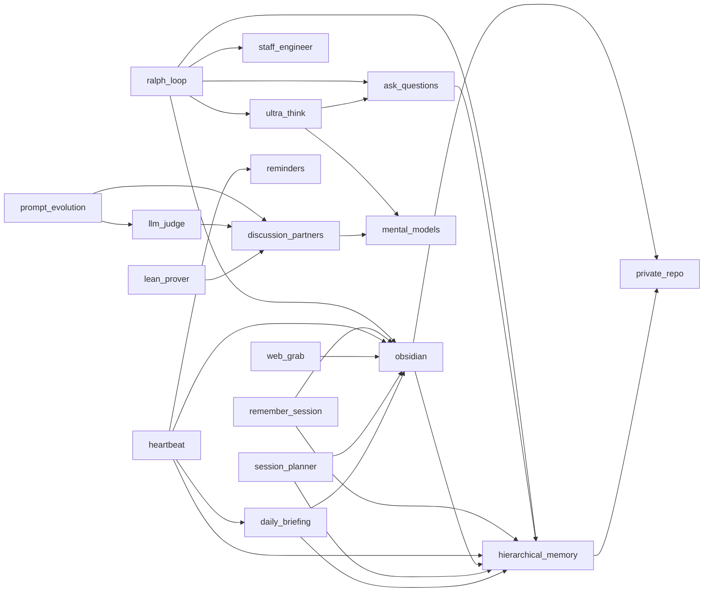

# Agent Skills

An open-source collection of AI agent skills for organizing your personal information automatically. Built on the [Agent Skills](https://agentskills.io) open standard. Works with Claude Code, Cursor, Codex, Gemini CLI, and 30+ other AI coding agents.

## Why This Exists

You have too many open tabs. You have ideas you don't want to forget. You have notes scattered across apps. You read things you'll never find again. The information is there — it's just not organized, and you don't have time to organize it yourself.

This is a system that lets AI agents do that organizing for you. The core loop is **capture, organize, process**:

1. **Capture** — Get information into the system with minimal effort. Dump your open tabs with `web_grab`. Dictate a random idea into `hierarchical_memory`. Save a PDF. The bar for capture is intentionally low.

2. **Organize** — The system structures information automatically over time. Daily notes aggregate into monthly summaries, then into an overall working memory. Web grabs land as atomic notes in an Obsidian vault with topic tags and wiki-links. A periodic heartbeat maintains the whole thing in the background.

3. **Process** — Once information is organized, thinking tools help you work with it. Mental models, deep thinking modes, and structured analysis skills operate on your accumulated knowledge rather than starting from scratch every session.

The two core storage layers complement each other:
- **Hierarchical memory** — A stream of consciousness that compresses over time. Daily notes are raw and noisy. Monthly summaries keep what mattered. The overall memory is a living profile of your current world: preferences, context, key facts, active projects. What you'd want a new assistant to know about you on day one.
- **Obsidian vault** — Durable topic notes organized as a knowledge graph. Web grabs, curated knowledge, reference material. Things that don't expire the way daily notes do. Connected by wiki-links and topic tags so related ideas find each other.

## Information Hierarchy

Four tiers of persistent information, each with a different purpose and lifetime:

| Tier | Location | Purpose | Lifetime |
|------|----------|---------|----------|
| **CLAUDE.md** | Per-repo | Agent config — how Claude behaves here | Permanent per repo |
| **README.md** | Per-repo | Dev memory — roadmap, decisions, lessons | Permanent per repo |
| **Hierarchical memory** | `memory/` | Personal working memory — daily notes, monthly summaries, overall | Compresses over time |
| **Knowledge graph** | `knowledge_graph/` | Durable topic notes, reference, web grabs | Permanent |

**CLAUDE.md** is read by every agent session. It defines conventions, anti-patterns, and build commands for a specific repo. Think of it as the repo's operating manual for AI agents.

**README.md** (this file, in the skills repo) serves as dev memory — the roadmap, architectural decisions, and lessons learned that persist across sessions. Updated as the project evolves.

**Hierarchical memory** is a stream of consciousness that compresses over time. Daily notes are raw and noisy. Monthly summaries keep what mattered. The overall memory is a living profile: preferences, context, key facts, active projects. The `note` command reports aggregation staleness automatically — finish your notes, then aggregate stale months.

**Knowledge graph** holds durable topic notes in an Obsidian vault. Web grabs, curated knowledge, reference material — things that don't expire the way daily notes do. Connected by wiki-links and topic tags.

## Skills

Skills are grouped by their role in the capture → organize → process pipeline.

### Capture

| Skill | Type | Description |
|-------|------|-------------|
| [hierarchical_memory](skills/hierarchical_memory/) | Python | Quick notes aggregated into daily/monthly/overall summaries |
| [web_grab](skills/web_grab/) | Python | Fetch URL content and save to obsidian — Playwright for JS SPAs |
| [pdf_to_markdown](skills/pdf_to_markdown/) | Python | Convert PDFs to clean markdown for vault storage |
| [remember_session](skills/remember_session/) | Prompt | Save session learnings to memory and obsidian |
| [skill_stealer](skills/skill_stealer/) | Prompt | Extract reusable skills from URLs into SKILL.md |

### Organize

| Skill | Type | Description |
|-------|------|-------------|
| [obsidian](skills/obsidian/) | Prompt | Read, write, search, and link notes in a git-backed Obsidian vault |
| [heartbeat](skills/heartbeat/) | Shell | launchd-based autonomous agent: picks up GitHub Issues, creates PRs |
| [private_repo](skills/private_repo/) | Prompt | Create or connect private GitHub repos for git-backed storage |
| [daily_briefing](skills/daily_briefing/) | Prompt | Morning summary from memory, tasks, and vault |
| [reminders](skills/reminders/) | Prompt | Time-aware reminders stored as markdown checklist in obsidian |
| [session_planner](skills/session_planner/) | Prompt | Plan a focused work session from memory, tasks, and context |

### Process

| Skill | Type | Description |
|-------|------|-------------|
| [ultra_think](skills/ultra_think/) | Prompt | Activate deep extended thinking for complex decisions |
| [mental_models](skills/mental_models/) | Prompt | 33 reasoning frameworks incl. critical analysis protocols (antithesize, excavate, negspace, rhetoricize, etc.) |
| [ask_questions](skills/ask_questions/) | Prompt | Structured questioning: clarify before acting |
| [discussion_partners](skills/discussion_partners/) | Python | Query OpenAI, Anthropic, or Google models for second opinions |
| [data_science](skills/data_science/) | Prompt | Opinionated DS defaults: XGBoost, nested CV, no shap |
| [forecast](skills/forecast/) | R | Time series forecasting with auto.arima |
| [lean_prover](skills/lean_prover/) | Prompt | Multi-agent Lean 4 theorem proving with search and repair |

### Build

| Skill | Type | Description |
|-------|------|-------------|
| [ralph_loop](skills/ralph_loop/) | Prompt | Autonomous development loop: decompose, implement, validate, repeat |
| [staff_engineer](skills/staff_engineer/) | Prompt | Performance-first engineering principles, coding standards, and debugging |
| [concise_writing](skills/concise_writing/) | Prompt | Writing principles for tight, scannable prose |
| [gh_cli](skills/gh_cli/) | Prompt | GitHub CLI usage patterns and permissions |
| [prompt_evolution](skills/prompt_evolution/) | Prompt | Evolve prompts through mutation and crossover |
| [llm_judge](skills/llm_judge/) | Prompt | LLM-as-judge evaluation for comparing outputs |
| [pr_review](skills/pr_review/) | Python | External AI code review: fetch PR context via gh, send to GPT-5.2 |
| [api_key_checker](skills/api_key_checker/) | Python | Verify AI provider API keys are configured and valid |
| [skill_pruner](skills/skill_pruner/) | Prompt | Audit skills for overlap, bloat, and quality |

## Skill Graph

Skills reference each other to compose larger workflows:



Standalone skills (no imports): `api_key_checker`, `concise_writing`, `data_science`, `forecast`, `gh_cli`, `pdf_to_markdown`, `pr_review`, `skill_pruner`, `skill_stealer`

## Install

### Via npx (recommended, works with all agents)

```bash
# Install all skills
npx skills add zachmayer/skills

# Install a specific skill
npx skills add zachmayer/skills -s pdf_to_markdown

# Install globally (available in all projects)
npx skills add zachmayer/skills -g
```

### Via Makefile (Claude Code, symlinks)

```bash
git clone https://github.com/zachmayer/skills.git
cd skills
make install        # Install deps, settings, and symlink skills
make install-local  # Settings + symlink skills only (no deps)
```

## Development

Requires [uv](https://docs.astral.sh/uv/getting-started/installation/).

```bash
make help           # Show all available targets
make install        # Install Python + deps + pre-commit hooks
make lint           # Run ruff linting and formatting
make typecheck      # Run ty type checker
make test           # Run pytest
make upgrade        # Upgrade all dependencies

```

## Creating a New Skill

Each skill is a directory under `skills/` with a `SKILL.md` file:

```
skills/my_skill/
├── SKILL.md           # Required: instructions + YAML frontmatter
└── scripts/           # Optional: bundled code
    └── my_script.py
```

The `SKILL.md` format:

```yaml
---
name: my_skill
description: >
  WHEN to use: <specific triggers>.
  WHEN NOT to use: <boundaries>.
---

Your instructions here. For skills with code, reference scripts:

uv run --directory SKILL_DIR python scripts/my_script.py $ARGUMENTS
```

Use the `/skill_stealer` skill to extract skills from URLs automatically.

## Python Skills

Skills that bundle Python code use [Click](https://click.palletsprojects.com/) for CLIs and [UV](https://docs.astral.sh/uv/) for execution. Dependencies are managed in the root `pyproject.toml`.

## Environment Variables

### Storage

| Variable | Default | Description |
|----------|---------|-------------|
| `CLAUDE_OBSIDIAN_DIR` | `~/claude/obsidian` | Vault root. All paths derive from it. |

### Config Files

| File | Default | Description |
|------|---------|-------------|
| `~/.claude/heartbeat-repos.conf` | `zachmayer/skills` | Repos for heartbeat to monitor. One `owner/repo` per line. See `skills/heartbeat/heartbeat-repos.conf.example`. |

Rigid subdirectories (Claude creates these automatically):
- `memory/` — hierarchical memory (daily logs, monthly summaries, `overall_memory.md`)
- `knowledge_graph/` — durable topic notes, personal knowledge

### API Keys

| Variable | Used by |
|----------|---------|
| `OPENAI_API_KEY` | `discussion_partners` (`openai:` and `openai-responses:` models) |
| `ANTHROPIC_API_KEY` | `discussion_partners` (`anthropic:` models) |
| `GOOGLE_API_KEY` | `discussion_partners` (`google-gla:` models) |

Add keys to your shell profile (`~/.zshrc` or `~/.bashrc`). Claude Code sources your shell profile at startup — no extra configuration needed.

## Roadmap

Tracked in [GitHub Issues](https://github.com/zachmayer/skills/issues). Label `agent-task` for heartbeat to pick up, `enhancement` for roadmap items.

### Completed

- **Consolidate beast_mode + ultra_think** — persistence directives folded into ultra_think.
- **Consolidate staff_engineer + debug** — debug's 9-step process folded into staff_engineer.
- **Heartbeat** — GitHub Issues as work queue. Agent picks from randomized list, claims by creating `heartbeat/issue-N` branch (atomic, no TOCTOU). Parallel by design. Safety: branch protection, CODEOWNERS, hardcoded issue filters, path restrictions, 4hr watchdog.
- **Session planner** — Read memory + tasks + todos, propose work plan.
- **API key checker** — Verify which API keys are configured and valid.
- **Playwright browser automation** — Headless browser for JS-heavy pages in web_grab.
- **Fix install-ci** — Heavy deps (marker-pdf, playwright) moved to optional extras.
- **Settings precedence** — Removed `gh pr create*` from project deny list (PR #43).

### Lessons Learned

- **Root-cause before you build** (2026-02): Misread `insufficient_quota` (billing) as "keys not found" (config). Built an entire .env/UV_ENV_FILE infrastructure to solve a problem that didn't exist. The actual fix: swap one API key. Diagnosis: 30 seconds. Unnecessary infrastructure: 1 hour.
- **Use scripts, not context, for bulk operations** (2026-02): Crawling 23 Confluence wiki pages with subagents blew context on all 5 agents. Next time: write a Python script that fetches and writes notes directly (Playwright → file), then run it in a loop. The agent's context window is for orchestration, not data transport. Also wrote one-off `audit_notes.py` and `fix_tags.py` scripts for vault maintenance — much better than manual inspection.
- **launchd over cron on macOS** (2026-02): Heartbeat cron job failed with "Not logged in" — cron has minimal env, no user security session, no Keychain access. launchd user agents run in the user session, survive sleep/wake, and are Apple-supported. `claude setup-token` provides 1-year OAuth tokens for headless use. `CLAUDE_CODE_OAUTH_TOKEN` is auth priority 2 (after `ANTHROPIC_API_KEY`), so unset API key explicitly to force subscription billing.
- **Optional extras for heavy deps** (2026-02): `marker-pdf` pulled in torch + CUDA (~3.8GB) on every CI run. Tests never imported it. Initially moved to `[project.optional-dependencies]`. Later, marker-pdf pinned `anthropic<0.47.0` which conflicted with pydantic-ai's `anthropic>=0.80.0`. Final fix: removed marker-pdf from pyproject.toml entirely and added PEP 723 inline script metadata to `convert.py`, so it runs in its own isolated env via `uv run --script`. Skills with heavy/conflicting deps should manage their own dependencies this way.
- **Don't trust training data for library APIs** (2026-02): PR #24 changed `result.output` to `result.data` because the agent "knew" pydantic-ai 1.57.0 had renamed the attribute. It hadn't — `.data` only existed in 0.0.31, renamed to `.output` in 0.1.0 and stable ever since (verified by installing 18 versions). The false fix was bundled into an unrelated PR (violating atomic PRs), persisted in project memory as fact, and wasn't caught until GPT-5.2 red-teaming triggered the error. Fix: always inspect installed code (`dir()`, `dataclasses.fields()`) before changing API usage. Added `test_pydantic_ai_compat.py` to catch future regressions automatically.

## License

MIT
